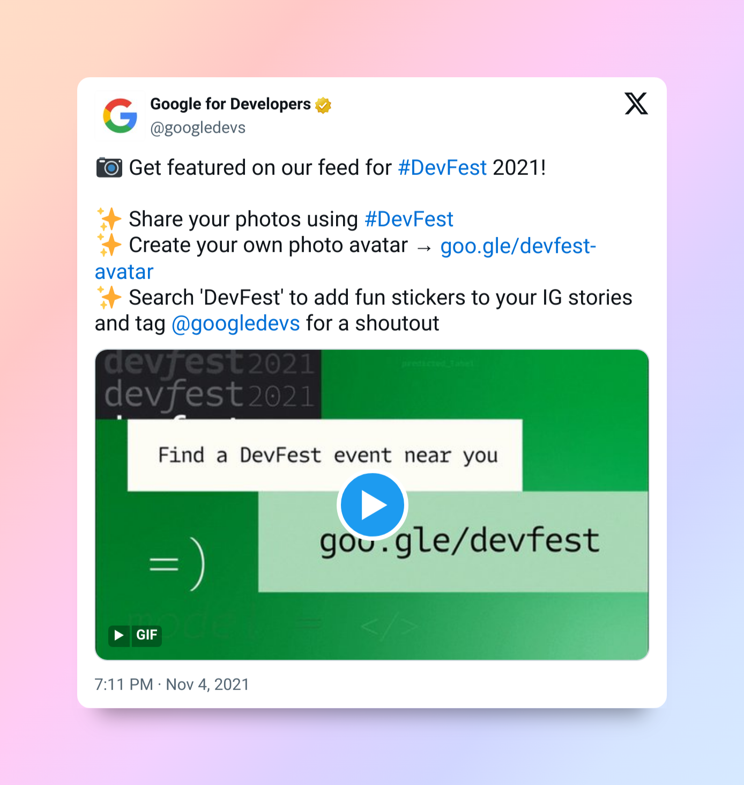
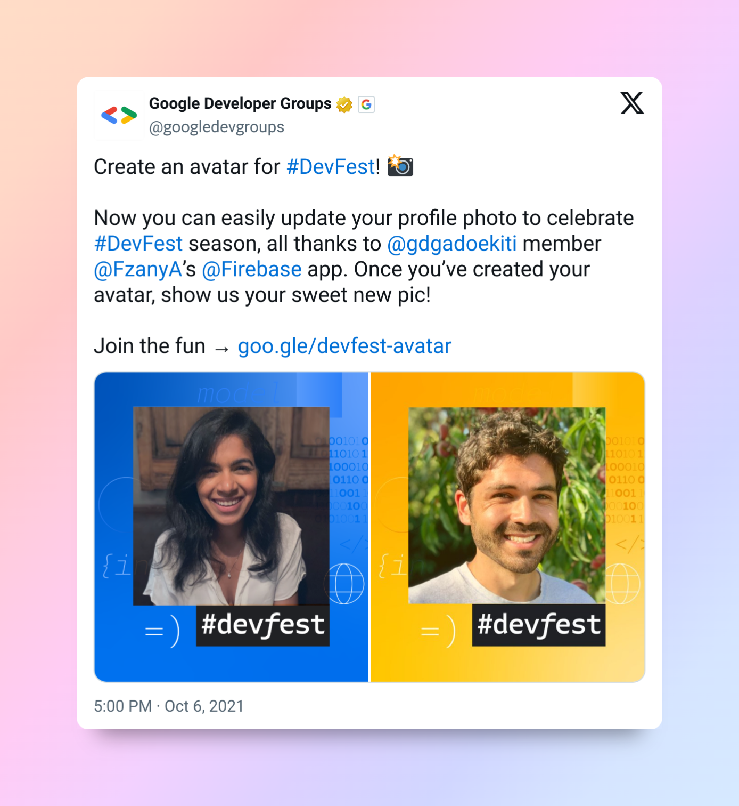
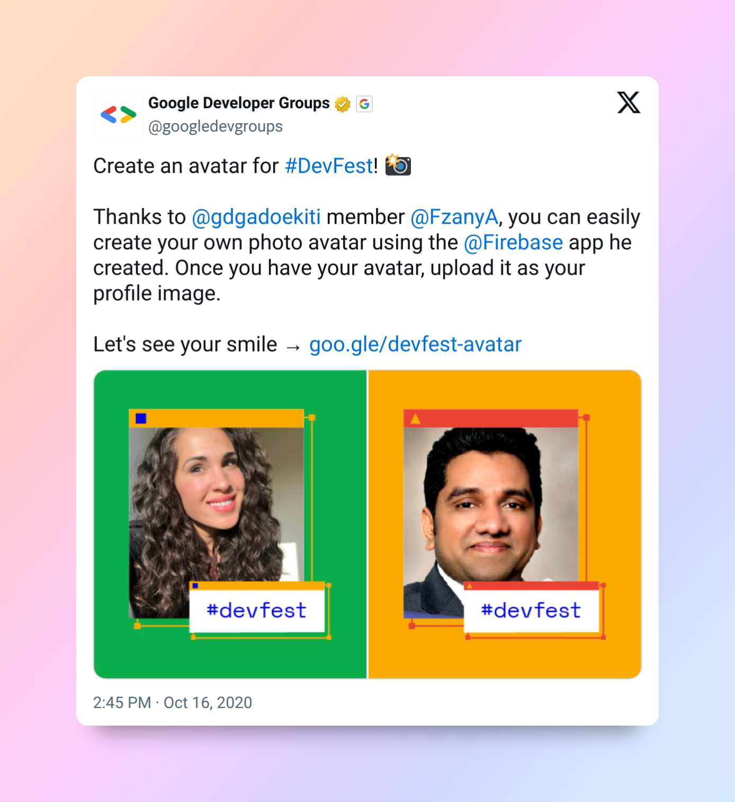
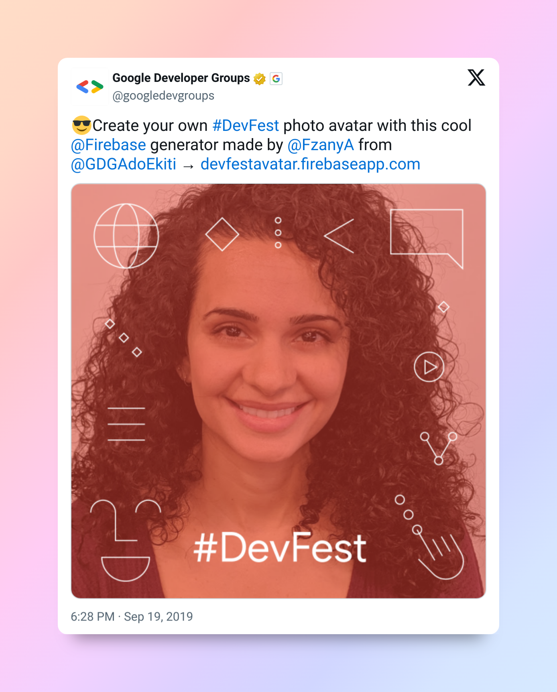

# DevFestAvatar

DevFestAvatar is a web app for creating custom avatars for #DevFest 2025. This year’s theme is “Building Safe, Secure and Scalable Solutions with AI and Cloud.” Easily generate, download, and share your unique DevFest look, and join the global conversation on responsible AI and scalable cloud solutions!

## Features
- Create and customize your DevFest avatar
- Gemini AI (Nano Banana) image editing powered by gemini-2.5-flash-image-preview
- Download your avatar for use on social media
- Share directly to X, Facebook, and LinkedIn
- Mobile-friendly and responsive design
- Stats counter for total avatars generated
- Theming support (light/dark)

### { } // + . -> <> * [] = <3 @ () 🌟 #️⃣🌐

## Contributing
Want to improve the app? Clone the project, add your features, and create a PR so we can review and merge your changes!

## Live Demo
Find the app at: [https://devfestavatar.web.app](https://devfestavatar.web.app)

---
For questions or support, reach out to the GDG Ado-Ekiti team.

## Wiki
View full documentation, contributions, archieves and promotion details in the [Wiki](https://github.com/olorunfemidavis/DevFestAvatar/wiki)

---
## GDG Promotions of the Avatar Creator Tool
Below is an archive of previous promotional posts showing past collaboration with the Google Developer Groups (GDG) and Google for Developers (GfD) communities. The tool was a huge hit, and we're happy to work together again in 2025!

 ### 2021 GfD Promo 
  

 [X post](https://x.com/googledevs/status/1456338241062416392) 

 ### 2021 
  

 [X post](https://x.com/googledevgroups/status/1445780953473843200) 

 ### 2020
 

 [X post](https://x.com/googledevgroups/status/1317099289827549189) 

 ### 2019 

 

 [X post 1](https://x.com/googledevgroups/status/1174737006691311619) 

 [X post 2](https://x.com/googledevgroups/status/1174737006691311619) 
