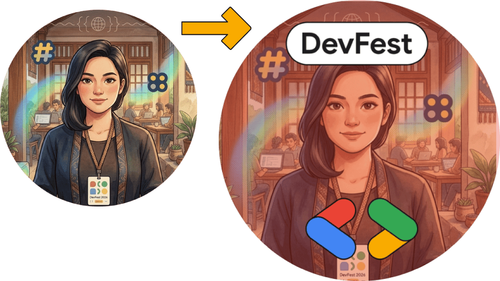

# DevFestAvatar

**Diğer dillerde oku:**  
[English](../../README.md) | [Español](README.es.md) | [Français](README.fr.md) | [Português](README.pt.md) | [Èdè Yorùbá](README.yo.md) | [Deutsch](README.de.md) | [Türkçe](README.tr.md) | [العربية](README.ar.md) | [हिन्दी](README.hi.md) | [日本語](README.ja.md) | [Kiswahili](README.sw.md)

DevFestAvatar, DevFest 2026 profil avatarları oluşturmak için tasarlanmış hafif bir web uygulamasıdır. Kullanıcılar bir fotoğraf yükler, bir DevFest çerçevesi seçer ve sonucu indirir veya paylaşır. Standart akış tamamen tarayıcıda çalışır.

Canlı uygulama: [https://devfestavatar.web.app](https://devfestavatar.web.app)



## Özellikler

- DevFest avatarlarını yükleyin, kırpın, çerçeveleyin, indirin ve paylaşın.
- Açık ve koyu tema desteği sunan DevFest 2026 arayüzü.
- Telefonlar, tabletler ve bilgisayarlar için duyarlı tasarım.
- Firebase Functions üzerinden isteğe bağlı Gemini yapay zeka düzenleme modu.

## Yerel Geliştirme

```powershell
http-server ./public -p 8081
```

`http-server` tarafından verilen adresi tarayıcınızda açın.
